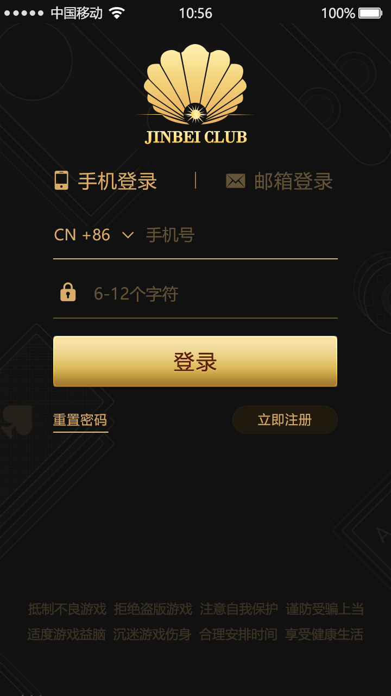
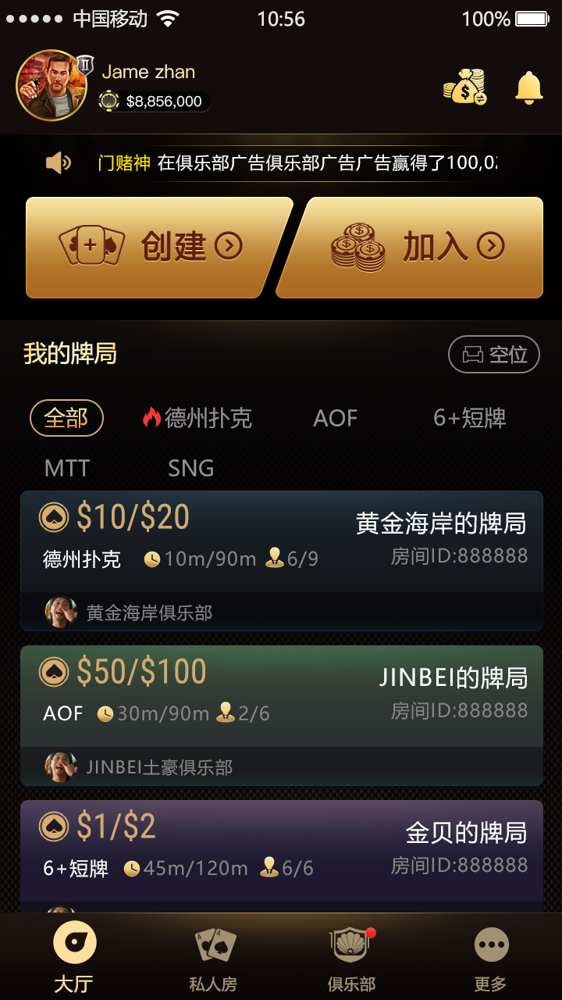
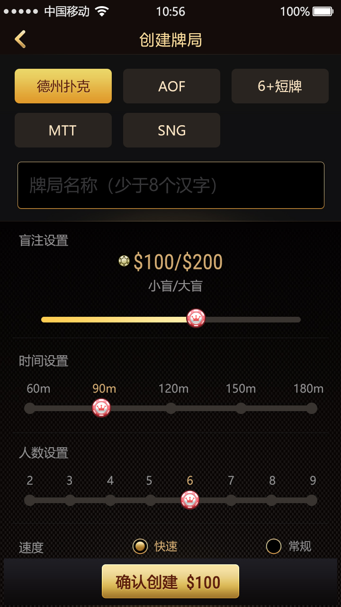
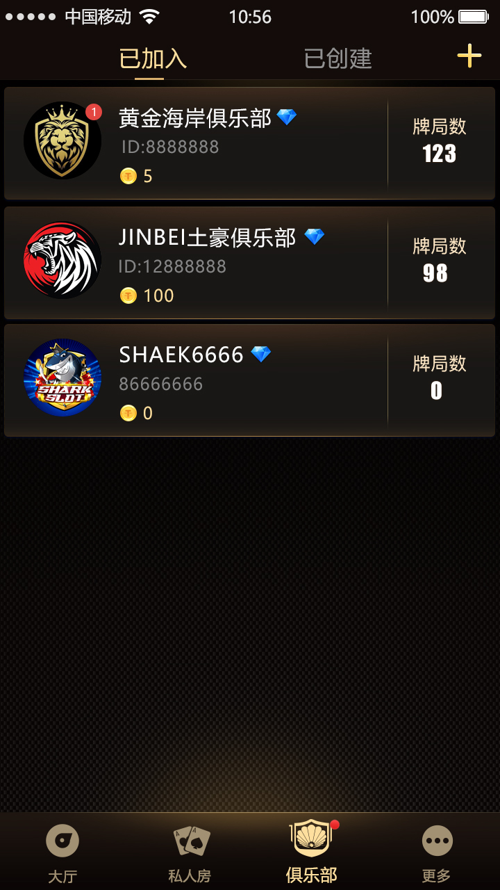
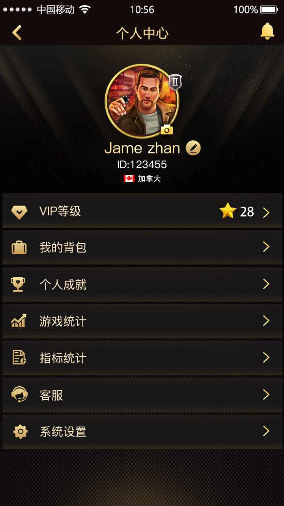
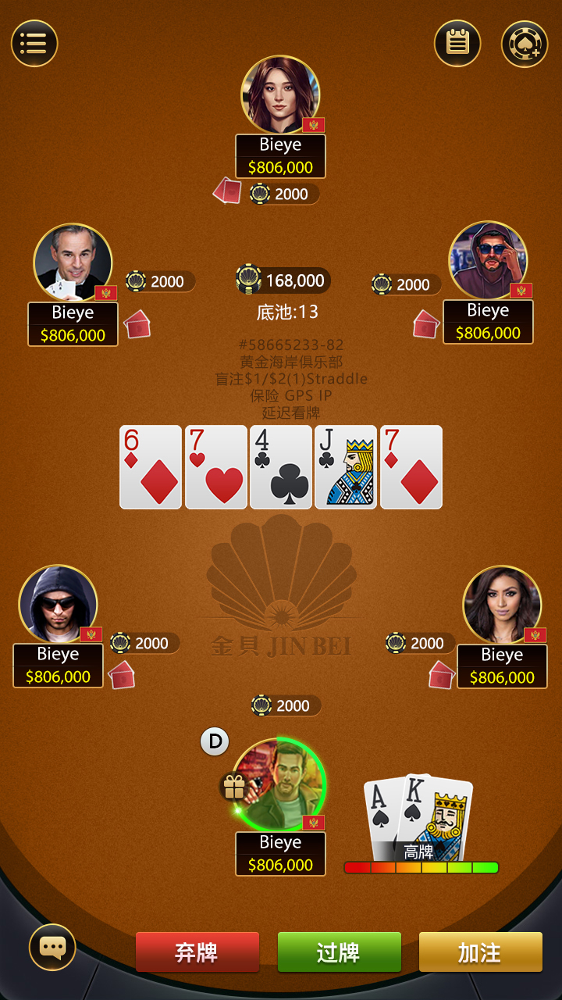

[简体中文](README.md) | [繁體中文](README.zh-TW.md) | [English](README.en.md)

# 德州撲克線上平台原始碼：C++ 即時牌局與房間服務

本倉庫公開一組面向**線上德州撲克平台**的 C++ 遊戲服務端元件、Tars 協定、房間/客戶端訊息處理程式碼與真實產品介面，適合研究多人牌局狀態機、下注訊息、房間同步、私人局與俱樂部流程。

> 範圍說明：本頁分開描述程式碼可核實能力與截圖展示入口。倉庫未公開 Docker Compose、資料庫初始化腳本或效能報告，因此不承諾一鍵部署、固定併發量或完整商業交付。

## 玩家看到的產品流程

1. **登入與帳戶入口**：手機登入、Email 登入、註冊與密碼找回。
2. **大廳與玩法篩選**：可見經典德州、AOF、6+ 短牌、MTT、SNG 和不同盲注/人數牌桌。
3. **建立私人牌局**：設定玩法、盲注、60–180 分鐘、2–9 人和速度。
4. **俱樂部體系**：建立或依 ID 加入俱樂部，查看已加入俱樂部與牌局數量。
5. **即時牌桌**：座位、底池、公共牌、底牌、棄牌、過牌與加注操作。
6. **個人資訊**：VIP、背包、成就、遊戲統計、指標統計、客服和設定入口。

## 真實產品截圖

| 登入與帳號 | 大廳與玩法 |
| --- | --- |
|  |  |
| 建立私人牌局 | 俱樂部列表 |
|  |  |
| 個人中心 | 多人即時牌桌 |
|  |  |

[查看繁體中文圖文產品頁](https://deeptexas-ai.github.io/online-holdem-platform/zh-tw/)

## 程式碼可核實的技術模組

| 模組 | 主要檔案 | 可驗證內容 |
| --- | --- | --- |
| 遊戲狀態機 | `process/process.cpp`、`process/process.h` | 開局、前注、莊家、底牌、公共牌、轉牌、河牌和結束狀態 |
| 牌桌恢復 | `gamestation.cpp` | 階段、玩家狀態、下注額、公共牌、底牌可見性與剩餘時間同步 |
| 訊息處理 | `message/`、`onclientmessage.*`、`onroommessage.*` | 客戶端/房間訊息及單人、全桌、觀察者廣播 |
| 德州協定 | `protos/dzproto.tars` | 盲注、帶入、下注、底池、發牌、紀錄、自動下注、買入和計時 |
| 遊戲服務 | `gameserver.*`、`gameroot.*` | 房間與遊戲服務通信、廣播與遊戲根物件 |
| 推送介面 | `PushServant.tars`、`PushServer.h` | 推送服務介面與服務端入口 |

## 玩法與產品邊界

- 程式碼明確展示盲注、底牌、公共牌、轉牌、河牌、下注、底池、買入、紀錄與結束流程。
- 截圖展示經典德州、AOF、6+ 短牌、MTT、SNG、私人房與俱樂部入口。
- 擴展玩法完整規則、賽事調度、支付、資料庫、管理後台、語音與生產部署需另行驗收。

## 聯絡方式

- Telegram：[@xuzongbin001](https://t.me/xuzongbin001)
- Email：[masterai918@gmail.com](mailto:masterai918@gmail.com)

請遵守所在地法律、平台規則、隱私及未成年人保護要求，不得用於非法賭博。

